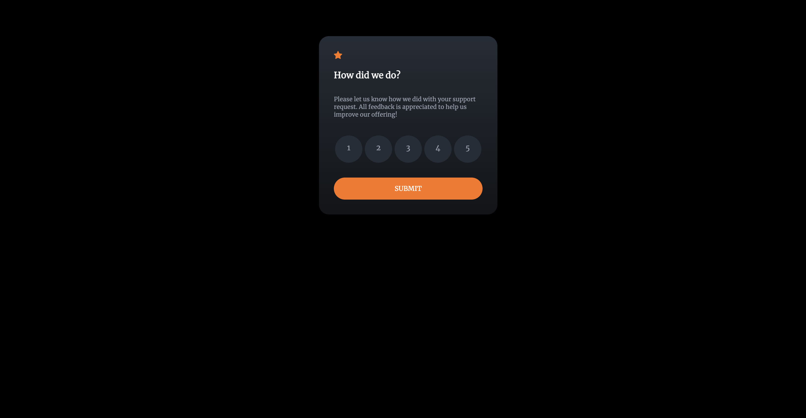
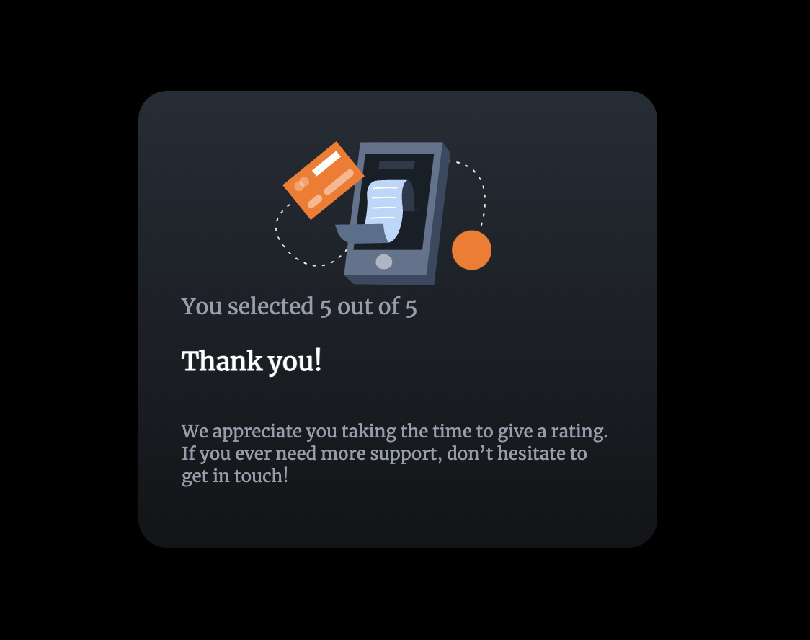
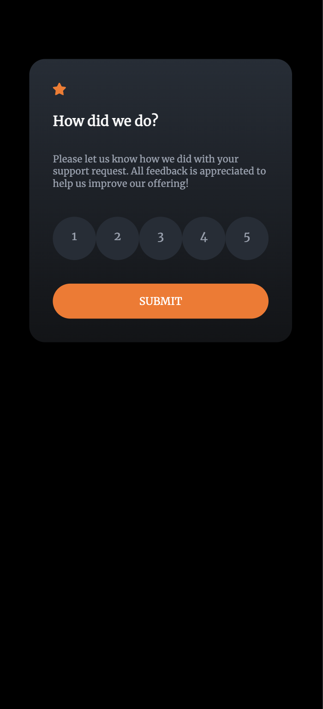
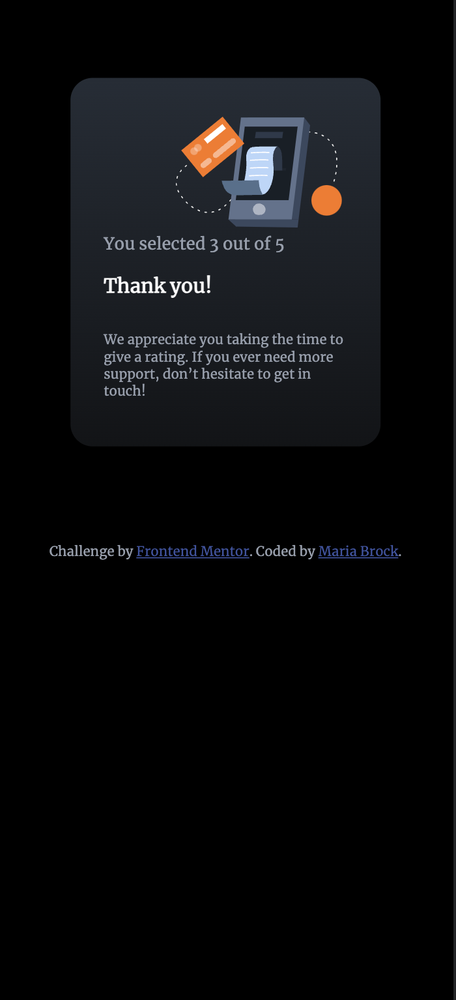
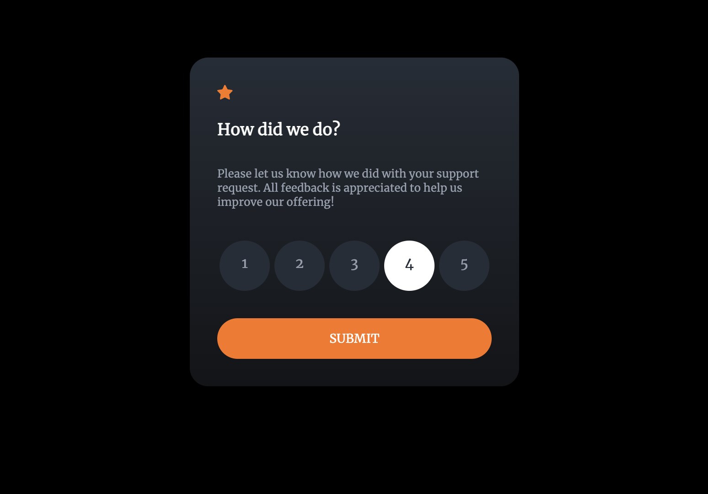
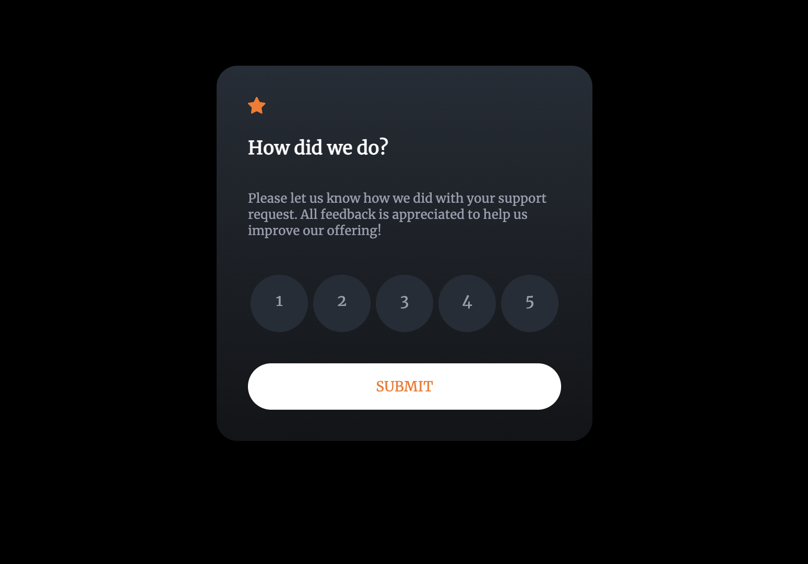
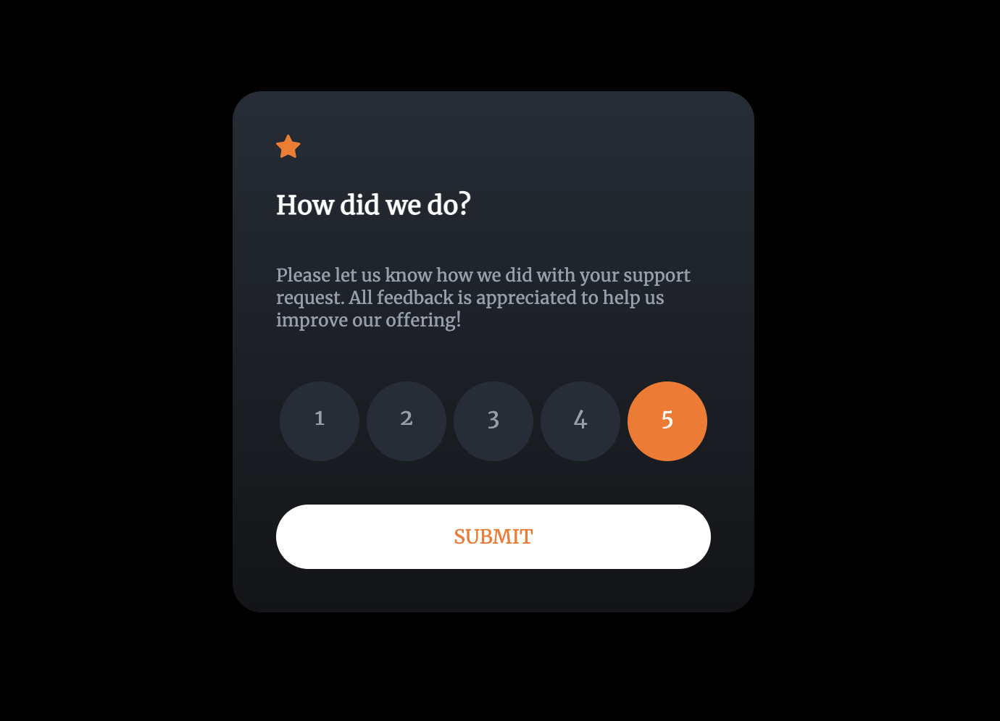

# Frontend Mentor - Interactive rating component solution

This is a solution to the [Interactive rating component challenge on Frontend Mentor](https://www.frontendmentor.io/challenges/interactive-rating-component-koxpeBUmI). Frontend Mentor challenges help you improve your coding skills by building realistic projects. 

## Table of contents

- [Frontend Mentor - Interactive rating component solution](#frontend-mentor---interactive-rating-component-solution)
  - [Table of contents](#table-of-contents)
  - [Overview](#overview)
    - [The challenge](#the-challenge)
    - [Screenshot](#screenshot)
    - [Links](#links)
    - [Built with](#built-with)
    - [What I learned](#what-i-learned)
  - [Author](#author)
  - [Acknowledgments](#acknowledgments)

## Overview

### The challenge

Users should be able to:

- View the optimal layout for the app depending on their device's screen size
- See hover states for all interactive elements on the page
- Select and submit a number rating
- See the "Thank you" card state after submitting a rating

### Screenshot









### Links

- Solution URL: [Github](https://github.com/mariabrock/interactive-rating-component)
- Live Site URL: [Github Pages](https://mariabrock.github.io/interactive-rating-component/)

### Built with

- Semantic HTML5 markup
- CSS custom properties
- Flexbox
- CSS Grid
- Mobile-first workflow
- Vanilla Javascript


### What I learned

```html
      <div id="thankyou-state">
        
        <div id="selection-text"></div>
        <h3>Thank you!</h3>
        <p>
          We appreciate you taking the time to give a rating. If you ever need
          more support, don’t hesitate to get in touch!
        </p>
      </div>
```
```css
#rating-state, #thankyou-state {
  display: flex;
  flex-direction: column;
  align-self: center;
  background-image: linear-gradient(hsl(213, 19%, 18%), hsl(216, 12%, 8%));
  margin: 5rem;
  padding: 2rem;
  border-radius: 20px;
  max-width: 300px;
}
```
```js
  const ratings = document.querySelectorAll('.rating');
  console.log(ratings);

  ratings.forEach (rating => {
    rating.addEventListener('click', function(e) {
      ratings.forEach(r => r.classList.remove('active'));
      e.target.classList.add('active');
      console.log(e.target.innerHTML)
    })
  });
```
## Author

- Github - [@mariabrock](https://github.com/mariabrock)
- Frontend Mentor - [@mariabrock](https://www.frontendmentor.io/profile/mariabrock)
- LinkedIn - [@mariabrock](https://www.linkedin.com/in/maria-brock/)

## Acknowledgments
